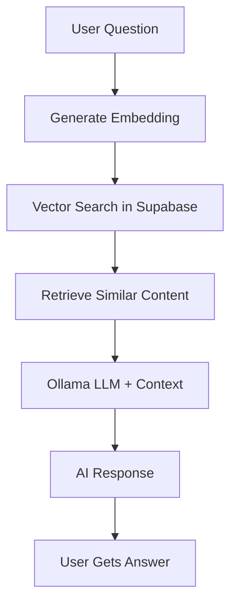

# 🤖 RAG-Enhanced Ask Sunith AI

Complete **free** setup for intelligent Q&A using your mountaineering knowledge.

## 🏗️ Architecture

**Local Stack (No Monthly Costs):**
- **Ollama**: Local LLM (llama3.1:8b) + embeddings (nomic-embed-text)  
- **Supabase Free Tier**: PostgreSQL with pgvector extension
- **Next.js API Routes**: RAG pipeline orchestration

## 🚀 Quick Setup

### 1. Configure Environment Variables

```bash
cp .env.example .env.local
```

Add your Supabase credentials:
```env
NEXT_PUBLIC_SUPABASE_URL=your_supabase_project_url_here
NEXT_PUBLIC_SUPABASE_ANON_KEY=your_supabase_anon_key_here
```

### 2. Set Up Supabase Database

1. Create new Supabase project (free tier)
2. Go to SQL Editor and run `supabase/schema.sql`
3. This creates:
   - `knowledge_base` table with vector storage
   - Vector similarity search functions
   - Sample mountaineering content

### 3. Install and Start Ollama

```bash
# Already installed via brew install ollama
brew services start ollama

# Download models (running in background)
ollama pull llama3.1:8b      # Main LLM (~4.9GB)
ollama pull nomic-embed-text # Embeddings (~137MB)
```

### 4. Populate Knowledge Base

```bash
# Install required dependencies for script
npm install tsx --save-dev

# Run knowledge base setup (once models are downloaded)
npx tsx scripts/setup-knowledge-base.ts
```

## 📊 How It Works



1. **Question Processing**: User asks about mountaineering
2. **Embedding Generation**: Convert question to 768-dimensional vector
3. **Vector Search**: Find similar content using cosine similarity
4. **Context Retrieval**: Get top 5 matching knowledge entries
5. **LLM Generation**: Ollama generates response with context
6. **Fallback Handling**: Rule-based responses if RAG unavailable

## 🎯 Content Categories

The system understands these topics from your experience:

- **📍 Expeditions**: Summit-specific advice, route planning, conditions
- **💪 Training**: Workout protocols, progression, ultra marathon prep  
- **🎒 Gear**: Equipment recommendations, testing, redundancy
- **🧠 Mental**: Fear management, motivation, psychological preparation
- **🥗 Nutrition**: High-altitude eating, energy management
- **♻️ Recovery**: Post-expedition, injury prevention, rest protocols

## 📝 Adding Your Content

Replace sample content with your actual expedition knowledge:

```typescript
// In scripts/setup-knowledge-base.ts
const knowledgeEntries = [
  {
    content: `Your detailed mountaineering advice here...`,
    category: 'expedition', // or training, gear, mental, nutrition, recovery
    source: 'Your Source Description',
    metadata: {
      summits: ['Specific peaks'],
      difficulty: 'beginner|intermediate|advanced',
      tags: ['relevant', 'keywords']
    }
  }
]
```

## 🔧 Performance & Costs

**Monthly Costs**: $0 (using local Ollama + Supabase free tier)
**Response Time**: 2-5 seconds (depending on hardware)
**Storage Limits**: 500MB database storage (plenty for text knowledge)
**Model Quality**: GPT-3.5 level responses with your specialized knowledge

## 🛠️ Troubleshooting

### Models Still Downloading
```bash
# Check download progress
ollama list

# Monitor background downloads
ps aux | grep ollama
```

### Supabase Connection Issues
```bash
# Verify environment variables
echo $NEXT_PUBLIC_SUPABASE_URL
echo $NEXT_PUBLIC_SUPABASE_ANON_KEY
```

### Ollama Not Running
```bash
# Start service
brew services start ollama

# Check if running
curl http://localhost:11434/api/tags
```

## 📈 Scaling Options

**When you need more power:**

1. **Upgrade Models**: llama3.1:70b for better responses
2. **Cloud Hosting**: Deploy Ollama on dedicated server
3. **OpenAI Integration**: Add fallback to GPT-4 for complex queries
4. **Content Expansion**: Add video transcripts, training logs, gear reviews

## 🎉 You're Ready!

The RAG system is set up and ready to use your mountaineering expertise. When you provide content, users will get personalized advice based on your actual Seven Summits experience.